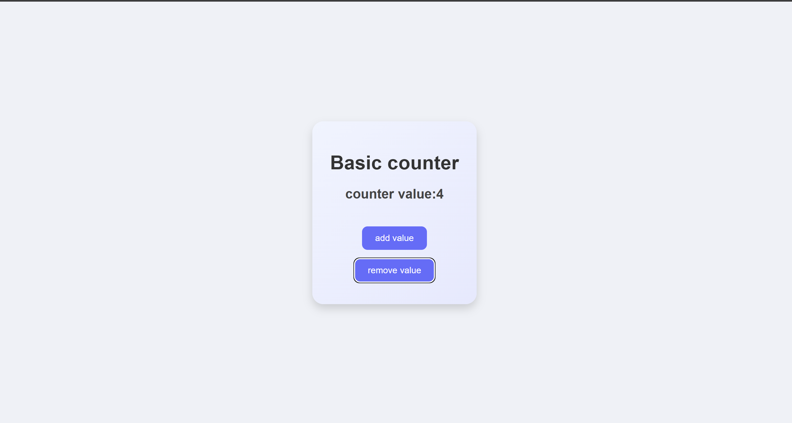

## 🧮Basic Counter App

A simple and interactive React Counter Application built using React’s useState hook.
This project demonstrates state management, conditional rendering, and component re-rendering concepts in React.


### 🛠️ Tech Stack


### 📸 Project Preview


<details>
<summary>🛠️ <b>Installation Steps</b> (Click to expand)</summary>

```bash
git clone https://github.com/Saadnaikwade1/React/tree/main/02counter
cd 02counter
npm install
npm run dev
```
</details>


## 📁 Folder Structure
```
📦 react-counter-app
┣ 📂 src
┃ ┣ 📂 assets 🖼️ → images and icons
┃ ┣ 📜 App.jsx → main component
┃ ┣ 🎨 App.css → component styles
┃ ┗ ⚙️ main.jsx → React entry file
┣ 📜 index.html
┣ 📜 package.json
┗ 🧾 README.md
```

#### 🧠 What I Learned

- How to use useState() for state management

- How component re-rendering works in React

- Styling a React component with scoped CSS

- Handling events and conditional logic


---

💡 Built with ❤️ by [Saad A. Naikwade](https://github.com/Saadnaikwade1)
- 💼 MERN Stack Developer 
- 📧 naikwadesaad@gmail.com
- 🌐 LinkedIn | GitHub
