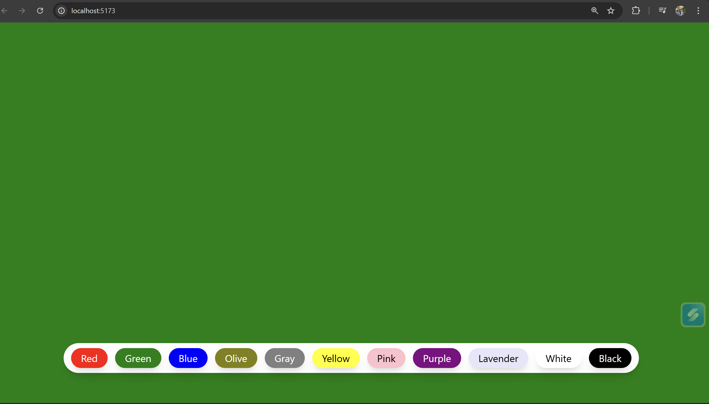

<h1 align="center">🎨 React Background Changer</h1>
<p align="center"> A simple, smooth, and interactive Background Changer built with <b>React</b>. Designed for a clean UI, seamless experience, and fast performance. </p>

## 📌 Live Demo  
🚀 [🎨 React Background Changer](https://backgroundchanger-obf1.onrender.com)

---
🌈 Overview

This project is a lightweight Background Color Changer application.
With a single click, users can instantly change the background to a random color — offering a fun and interactive UI experience.

Built using:

- useState for managing color state

- React components for clean UI structure

- Button interaction for seamless user experience

---
✨ Features

🎨 One-click background color change

⚡ Fast rendering with React

🧩 Clean and minimal UI

🔁 Random color generator

📱 Fully responsive design

---

🛠️ Tech Stack
- Frontend

- React

- JavaScript (ES6+)

- HTML5

- CSS3

- React Hooks Used

- useState — store and update color state

---

```bash

Build Tool

Vite

📦 Installation

After forking or cloning the repository, install the required dependencies:

npm install


This installs:

react

react-dom

vite (if used)

If needed manually:

npm install react react-dom
npm install -D vite

▶️ Run Locally

For Vite:

npm run dev

🧱 Build for Production
npm run build

```
---

📸 Screenshot



<p align="center"> 💙 Designed & Developed by <b>Saad A. Naikwade</b> — focusing on clean UI, smooth interaction, and great UX. </p>
