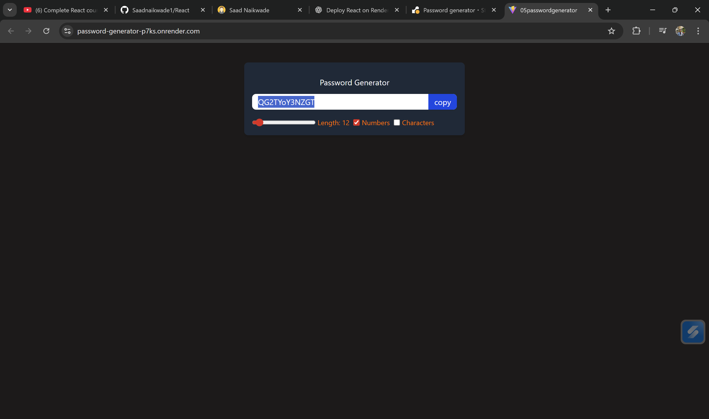

<h1 align="center">🔐 React Password Generator</h1>

<p align="center">
  A clean, responsive, and user-friendly Password Generator built with <b>React</b>.  
  Designed with a focus on <b>UI/UX</b>, accessibility, and smooth user interaction.
</p>

---

## 🎨 Overview

This project is a modern **Password Generator** application where users can generate secure passwords with customizable controls.  

- Applying React best practices using **useState**, **useEffect**, and **useRef**  
- Ensuring seamless interactions like easy copy-to-clipboard  

---

## ✨ Features

- 🔢 Adjustable password length  
- 🔡 Include/Exclude numbers  
- 🔣 Include/Exclude special characters  
- 📋 One-click copy to clipboard (via useRef)  
- ⚛️ Real-time password updates (via useEffect)  
- ⚡ Fast rendering using React hooks  

---

## 🛠️ Tech Stack

### **Frontend**
- React  
- JavaScript (ES6+)  
- HTML5  
- CSS3  

### **React Hooks Used**
- `useState` — manage UI states  
- `useEffect` — generate passwords dynamically  
- `useRef` — copying password to clipboard  

### **Build Tool**
- Vite   
---
## 📦 Installation

After forking or cloning the repository, install dependencies:

```bash
npm install
This installs:

react
react-dom

vite (if used)

If needed manually:

bash
Copy code
npm install react react-dom
npm install -D vite

▶️ Run Locally
For Vite:
bash
Copy code
npm run dev

🧱 Build for Production
bash
Copy code
npm run build
```
---
### 📸 Screenshots



---
<p align="center">
  💙 Designed & Developed by <b>Saad A. Naikwade</b> — focused on clean design, smooth interaction, and great UX.
</p>


